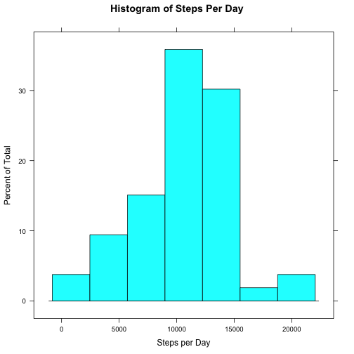
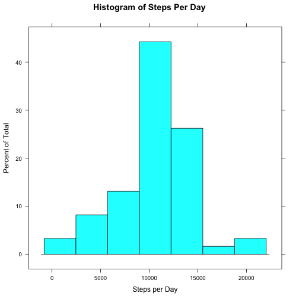
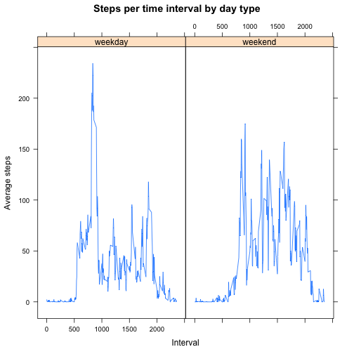

# Reproducible Research: Peer Assessment 1


## Loading and preprocessing the data

```r
activity <- read.csv("activity.csv")
activity$date <- as.Date(activity$date)
```


## What is mean total number of steps taken per day?
Histogram of steps per day

```r
library(lattice)
stepsByDate <- aggregate(activity$steps ~ activity$date, activity, sum)
colnames(stepsByDate) <- c("date", "steps")
histogram(stepsByDate[, 2], xlab = "Steps per Day", main = "Histogram of Steps Per Day")
```

 

Mean and median of steps per day

```r
mean(stepsByDate[, 2], na.rm = TRUE)
```

```
## [1] 10766
```

```r
median(stepsByDate[, 2], na.rm = TRUE)
```

```
## [1] 10765
```

## What is the average daily activity pattern?
Time series plot of the 5-minute interval (x-axis) and the average number of steps taken, averaged across all days (y-axis)

```r
stepsByInterval <- aggregate(activity$steps ~ activity$interval, activity, mean)
plot(stepsByInterval[, 1], stepsByInterval[, 2], type = "l", xlab = "Time Interval", 
    ylab = "Average Steps", main = "Average Steps per Time Interval", lwd = 1)
```

 

Which 5-minute interval, on average across all the days in the dataset, contains the maximum number of steps?

```r
maxIndex <- which.max(stepsByInterval[, 2])
stepsByInterval[maxIndex, ]
```

```
##     activity$interval activity$steps
## 104               835          206.2
```

## Inputing missing values
Total number of missing values in the dataset

```r
sum(is.na(activity))
```

```
## [1] 2304
```

Creating a new dataset with missing values filled in with mean number of steps for that interval

```r
library("zoo")
activity$stepsNA <- na.aggregate(activity$steps, by = activity$interval, FUN = mean)
```


Make a histogram of the total number of steps taken each day and Calculate and report the mean and median total number of steps taken per day.

```r
stepsByDate2 <- aggregate(activity$stepsNA ~ activity$date, activity, sum)
histogram(stepsByDate2[, 2], xlab = "Steps per Day", main = "Histogram of Steps Per Day")
```

 

```r
mean(stepsByDate2[, 2], na.rm = TRUE)
```

```
## [1] 10766
```

```r
median(stepsByDate2[, 2], na.rm = TRUE)
```

```
## [1] 10766
```

What is the impact of imputing missing data on the estimates of the total daily number of steps?
Mean changes:

```r
mean(stepsByDate2[, 2], na.rm = TRUE) - mean(stepsByDate[, 2], na.rm = TRUE)
```

```
## [1] 0
```

Median changes:

```r
median(stepsByDate2[, 2], na.rm = TRUE) - median(stepsByDate[, 2], na.rm = TRUE)
```

```
## [1] 1.189
```

## Are there differences in activity patterns between weekdays and weekends?
Creating a new factor variable in the dataset with two levels – “weekday” and “weekend” indicating whether a given date is a weekday or weekend day.

```r
ping <- weekdays(activity$date)
ping[ping == "Sunday" | ping == "Saturday"] <- "weekend"
ping[ping != "weekend"] <- "weekday"
activity$day <- ping
activity$day <- factor(activity$day, levels = c("weekday", "weekend"))
```


Panel plot containing a time series plot (i.e. type = "l") of the 5-minute interval (x-axis) and the average number of steps taken, averaged across all weekday days or weekend days (y-axis). 

```r
stepsByDay <- aggregate(activity$steps ~ activity$interval + activity$day, activity, 
    mean)
colnames(stepsByDay) <- c("interval", "day", "stepsMean")
xyplot(stepsMean ~ interval | day, stepsByDay, type = "l", main = "Steps per time interval by day type", 
    ylab = "Average steps", xlab = "Interval")
```

 

